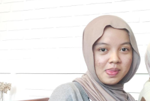

<!-- Animated Gradient Header -->

  

<!-- Profile Picture -->

  

<h1 align="center">💜🍵 Hi, I'm <a href="https://github.com/jemmaaa88">Jemalia Khairany</a> 🍵💜</h1>

<!-- Typing Animation -->

  

---

## 🌸 About Me
💻 Enthusiast in **Web & App Design**  
✈️ Curious soul who loves **Travelling**  
🍱 Passionate about **Culinary & Cooking**  
💜 Inspired by **Soft Purple vibes**  
🍵 Fueled by **Matcha creativity**  
✨ Always eager to learn something new  

---

## 🌟 Interests
- 🎨 Web Design & App Design  
- ✈️ Travelling  
- 🍱 Culinary & Cooking  
- 💜 Lavender Aesthetic  
- 🍵 Matcha Everything  
- 💻 IT & Tech  

---

## 🛠️ Skills & Tools

  
  
  
  
  

---

## 📱 Connect with Me

  
  

---

## 📊 GitHub Stats

  
  

  

---

## 🔥 Streaks & Activity

  

---

## 🎠 Fun Animation Zone

  
  
  

  <marquee behavior="alternate" scrollamount="6" width="80%">
    🌸💻 Eat 🍱 | Travel ✈️ | Code 💻 | Dream 💜 | Drink Matcha 🍵 | Repeat 🔄
  </marquee>

---

<!-- Animated Footer -->

  

